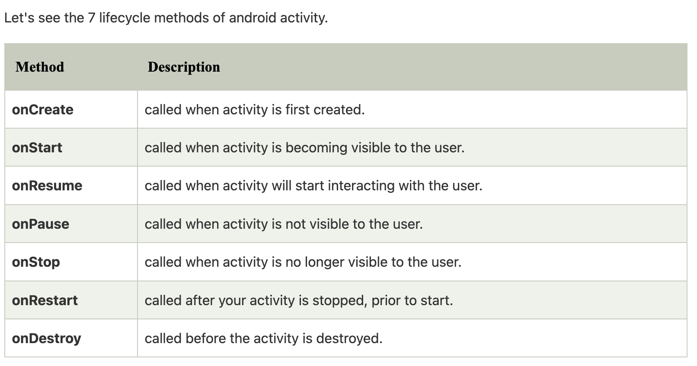

# Application System Design


* Classes of UI elements 
* Callbacks ( onlcick handles)
* Mark up language to describe UI 

Android UI

* Activities : screens 
* Views : UI Elements
* Fragments: grouping of the UI elements views. 

## For Designing layout :  

* XML file fot layout 
* Kotlin file call back 

Fragments can contains other fragments. Activity contains fragments. Use fragments and navigate between them. Nice way to navigate thru fragments. 

### Common Layouts: 

* Linerar layout: row and column orientation. fun hahah 

* GridLayout : Arrange things in grid view

* Table Layout 

* Frame Layout: Does nothing. Draws things on the top of each other. 
* Constraint Layout : Have childdren and specify the constrains according to the parent. Organize them and they can adjust the based on how you want. ( Not present to use, pain in the butt accoring to Dr.Jones)

### View Attributes

* Width/height : Fixed size
* Match parent: Expand as big as possible to the parent size ( can be width or height)
* Wrap content: Be as big you need to be to fit the parent. 
* Padding /marging ( padding is more like increaing background and margin is more of increasing the space with the other)
* Gravity: top, Botton, center around left and right 
* Layout gravity
* Colors 
* Size : unit size is : "display pixels,  **'dp'** and text size is **'sp'** scale pixels


## Lecture 2: Activities and Intents 

Click listener 

```kotlin
   findViewById<Button>(R.id.buttonID).setOnClickListener { myview : View ->
            Log.e("GD", myview.toString()) // e stands for error , d for debug. Best practice use, the tag as the fragment name
            textView = findViewById<TextView>(R.id.textViewID) // val means  constant
//            textView.text = "Next Text"
            textView.text  = "Gloria"
        }
```

```kotlin
findViewById<Button>(R.id.buttonID).setOnClickListener(B)
var clicklistern = View.OnClickListener() { // OnClickListener is an interface. Which has one method. we don't need to call it you can just implement it. Refer to Ben's code
}

```

### Data binding

* get the binding object for each fragment or activity. It returns a view that can help identingy the types of the views. To avoid mis match of the file. 

  In the app gridle. Add these code and instead of findingViewbyID, this time, you'd have to do `binding.id`

  ````kotlin
   buildFeatures {
          viewBinding = true
          dataBinding = true
      }
  ````

* In the oncreate method. Add the. Binding and inflate the layout/activity 

  ```kotlin
  val binding = A.inflate(layoutInflator)
  binding.buttonID.setOnclickListener{}
  setContentView(binding.root) // don't use the id
  ```

### Toasts

* A pop message that goes comes and goes away 

  ```kotlin
  Toast.maketest(this, "Invalid bla", Toast.LENGTH_SHORT).show() // this is the context. Use the current activity that you want the message to display. 
  ```

### Linking Activities: intents

* Swtiching between the activities

  2 types of intents 

  * Explicity intents
  * Implicity intents 

#### Explicity Intents 

* `val intent = Intent(this, Activity::class.java)`

  to store intents with things when sending them out.Use a `Bundle()`

  ````kotlin
  val msbundle = Bundle()
  msbundle.putString(Key,value)
  intent.putExtras(msbundle)
  ````

  `when` is like a `switch case` in java.

#### Implicits: Maps and Camera

* Implicits intents Maps: , you don't identify the activity to go to. The App comes decided on what to switch to. For example. using URI and switch of the maps. You don't have to necessary say switch top other maps. 
* IMplicity Camera. in the hash map, there is a `Bitmap::class.java` 


URI is  

Lifecyle

## Android Activity Lifecycle methods




onDestroy() is like a destructor in c++. 

The garbage collector, there is no ordering. But in destructor there is 

Finalilzers in c#, the idisposable interface. used `using()` and that is calling idisposable in the end of the `{}` 

### Stroring data

* In activity: member variable. If we destroy and recreate the activity, the member variable will be lost. 
* in VIEWs ( like the text that is written in the view)
* If We need data to persit, we use callback cakksed `on SaveInstanceState()` it gives a way of storing data in bundles. `onRestoreInstanceState()` allows to grab data and update the views. 
* This is a bad design. BCz each time you create the activity, you'd have to remember the data. Save and restore all the time. 

Example: Create a Todo List

* add and remove items
* Views you might need are Edit text to add anew, button, list. 

## MVVM Architecture

Model View View Model 

VIew: What we see

Model: **Will store the data.** 

ViewModel ---> Views : Any data thaat we need 
Views ----> VM user interaction should update teh model. 

VM--> Model : Change 

Model --> VM -> get data 

#### What we need to implement MVVM architecture

* VM class in Android are life cycle. : perist through life cycle. They will not be part of the lifecle of the activity. 

* change the model methods, normal methods. The names of the method should reflect how the data is being change. 

* Create a LIVE DATA class, wrapper class. Wrapp around the values, `LiveData<String>` . Views observer live data. There is observe method that takes a call back and anytime we update the data, the data is updated in the view. This is automatically. View models handles what the data changes are and the views don't know what is going.  `observe()` gets the lifecylce owner as parameter. such as `observe(this)`

* In order to create a viewModel object you use, the delegated syntax. use `by` keyword. 

  

#### Displaying Data in a list 

* Use a **RecylerView**. YOu need three classes to use it. Solves containsts layout. 
  * Layout manager: How to organize individual laid out. A snippet of view 
  * View Holder : Keeps tracks of layout template. and gets resused when scrolling. 
  * Adapter: Responsible creating views when needed. Creating and rebinding the new view holder. 
  * Animator: Animation cnagneg of the list. (optional)

Kotlin Delegated property. 

* propery that calls another project. 
* It does have a lazy 
* If you run your project for the first time, it creates the viewmodel object and will be used every single time you run your program. It doesn't recreate that object. It is only created once. That is why it is called a lazy. 

if is an expression in Kotlin and it has a value as opposed to statement. There is a difference between kotlin and statement. 

* DOn't touch data outised the view model except through the observer. 


## Fragments 

Activities are like screens. 

View models are always associated with activities. For example if you have one activity, you view model will be used to share data accrooss that one activity. It is tricky to share one view model with amny activites. The solution is to have multiple fragments for one activity and just have one activity. 

* a fragment is a reusable activity 
* groupping things together 

You can switch fragments at run time. 

Have a view container in activity that will hold the fragments at run time. 
`SupportFragmentManager.beginTransaction()`  this will change the fragment at runtime.  Add a string tag so that you can access it later. There is no ID for fragments. 

If you know ahead of time what fragment you want in your activity, you can have a fragment layout in your activity xml layout. This case you have the ID for the Fragment that you can use in case you want to search for this specific fragment later. Use `findViewByID()` 

* Always use the view model as the source of data. let all fragments get their data from the view model. There is a delegate for just fragment. use ` by activityViewModels()` 

### commonly used Callbacks for fragments 

* On create()
* `OncreateView() ` : mostly used one. The only one that is we might use. 
* on Pause() : you can use this mabye when you 

## Custom Views

* create your own class that inherit from View. 

* Constructor signature is particular . It must looks like this. Two member variables which are context and attributes. 

  ```
  class mycustomView(contex: Context, attrs: attributeSet) : View(context, attrs)
  ```

* Bunch of callbacks that are inherited from View. But the most important one is `onDraw(canvas: Canvas)`  

  * canvas is an object that can be used to draw
  * Canvas comes with a bitmap class that you can draw on. Image you draw, you draw it on the bitmap
  * the canvas class has a `drawbitmap()` that copies content from the 

* `addtobackStack()` is a way of going back to the prev fragment. use the back arror on the emulator. 


# Jetpack

* Jet pack is an Androud libraries for Android. 

* ViewMode + LiveData Classes + libraries  are all part of Jet Pack

  ### Navigation we've seen so far

* View model : Data persitence, lifecycle, data sharing 
* Intent : navigate between activities
* Fragment Transaction manager : construct Fragmebt object to navigate 

## 	Navigation Graph

* Allows to have the path between parts of the app as graph. Usually it is in the form of xml. 

   To create a navitation graph 

  ```
  1. right click new on the res
  2. choose "android resource file"
  3. select navagation
  ```

* Jet pack Navigation helps us with navigation through out the app. We get rid of  fragment transactions.

* Nodes of the graph becomes our fragments. 

* Navigation Graph also allows us Deep linking: Deep linking is a link (url) that takes you directly to a specific destination within an app. This link can also take you back.

* To do this, we'll have our Activity just show a `FragmentContainerView` which will show a `NavHostFragment`

* You'll need to set these XML attributes: 

  ```kotlin
  app:defaultNavHost="true" 
  app:navGraph="@navigation/your_xml_file
  ```

* This fragment will use the Navigation graph to determine which fragment to show first, and will respond to navigation requests and update the fragment for us

### 	Navigating 

* The easiest way is to navigate is the `findNavController().navigate(R.id.theFragmentId)` . This hack also manages the back stack for us. 

* There is a long tuitotial on the website about this.Check it out! 

  

# Testing 

## 1. Unit Testing 

* Use  JUnit Library

* Any code that isn't UI related such as Views and event listener stuffs should all be tested in the folder 

   `java.your.package.test.folder`

* ViewModels should also be tested here. 
* Test plain function that you declare 

### Junit 

* #### Test ( found in test directory ) 

   * Contains Kotlin code. These are plain tests. 
     * Goes in `test` folder 
   * Data processing, vanilla Jnuit, 
   * Test plain function that you declare 

* #### Instrumental test 

  * Works fine with Kotlin code that atre not Android Specific 

  * Goes in `android test folder`	

  * These tests do run on the emulator and go in android test folder 

  * Use mocks for testing. Helps makes sure that you are using the most interface. It helps you focus your design. 

  * Some code that requires android to run some goes here. 

  * Use instrumental test to test code that uses Android classes such as `Color` 

  * Live Data requires Android component to run so goes in instrumental tests. 

  * These instrumental tests give you access to other android projects including Context object. ect. Whihc is nice bcz you can test part of the app without running full the whole app. 

    

### UI Testing : Espresso.

* A libray that you can use to test the full app

* Allow us to test your full app's UI. enable you find views by ID. Once you have the view you can verify that you have the what you want to have. Example, does the view contains a text that you want.

* It will be slower compared to other testing bca you have to rerun the whole app. 

* Easy to write tests that perform sequences of user actions and then assert that the app bheaves as expected. 

* [Espresso Cheat sheet](https://developer.android.com/training/testing/espresso/cheat-sheet)

# Concurrency 

Tasks are overllaping in real time. 

Threads can handle each task in parralle to acheiver concurrency 

Multithreading and parallelism. 

### 	**Downside:** 

* When there is shared data .

	* All Synchronization is programming responsibilities
	* Create and destroy a thread is exprensive. Expensive to create and switch between threads bcz of involve kernel 
	* Debugging is hard. 

Relatve life time of threads. 

* It doesn't depend on how or when threads are created. 

`Select()` wait for any of a set of file descriptibrd to be ready.  

```
while(Select()) {// locked Select there is no use of CPU time, 
Handle socket that is ready. 
}
```


## Common libraries to achieve this. 

You provide callbacks for different event types. Where server socket has client, here is what to to. This is how you'd build the program. 

* lib event 

* Ribs

  * No Parallellism 
  * Most of the time is spend waiting. 
  * No locks, no mutex. Meaning no one can touch your code. 
  * `yield()` function threading where Threads explicity 'yield'
  * Switching is fast
  * Allocation is fast. We can have houndreds and thousands of these. And that is okay! 
  * No kernel is involved. 
  * `Read ()` -> wrapped - `read()`schedule and read then `yield()`. 

  

  Promises / futues

  ## Coroutine

  Function can that can run and be paused and be resumed later. 

  

  Team 

  * What fragments did we use ? 
  * Enums ( list of constant circle, rectangle, )
  * View models stuff frgament
  * fr attahce attached tothe view 
  * Drawinng code in its own fragemtnt. And attache 
  * On draw to the view will draw the bitmap( disaoly it)
  * in order to draw we need Canvas that wrapping the bit map, 
  * redrawmethod ( invalidate)
  * Custom view ( setter )
  * Splash screen ( create navigation)

  

  

  ```kotlin
  
  
  ```
  
  
  
  # Peristence Storage
  
  ## Files and Rooms
  
  ## DataStore
  
  * Datastore is perisitence and provides key and values storage. It is a SSD bundle
  * API uses coroutine and flows ( so we will have to use coroutines)
  * It is SSD persistence hashtable
  * It gets destroyed when you rebuild the app
  * There is a also a type safe version ( we won't cover it this time)
  * use to create a simple, safer and asynchronous API for storing data
  
  ## Datastore setup code
  
  ````kotlin
  // this extension part goes outside outside the class. 
  val Contex.datastore: DataStore<Preferences> by preferenceDataStore(name = "preferenceFilename") // all this are functions that are being called. It looks like we are accessing it.
  
  
  inside your context
  // access the datastore by doing this
  val prefs: Flows<Preferences> datastore.data // will track prefs in the map over time and gets updates 
  // type safe
  val keyForIntValye : Prefernces.Key<Int> = intPreferences("SomeKey") // the key here will  an int. 
  you want to use key as string by calling stringPreferencesKey("another_key")
  val keyForStringValue = stringPreferenceskey("another_key") // the key wher is a string
  ````
  
  Flows are like coroutines for live data. 
  
  
  
  ## Edititng or Writing the DataStore operations. 
  
  ```kotlin
  // a suspend func, so run in a coroutine scoel 
  datastore.edit { prefs: MutablePreferences -> 
    prefs[myKey] = myvalue
  }
  
  // collect() is used to update. It acts as livedata.observe()
  preferences.collect() {
    
  }
  
  ```
  
  
  
  Datastore is a hashTable for Kotline but which is stored on the ssd. 
  
  ## When to use DataStore
  
  * Simple and small key-value data
  * Requires no permission, but it is slow since it is store on the disk. 
  * When you get data from datastore, it loads the whole thing, and when you do any other activity it loads the whole thing. 
  
  ## Files
  
  * Same APi as java ( all the file system works here too)
  * The issues comes with where you want to put these code. 
  * getFilesDr()` and `getExternalFilesDir()` will return the file objects that corresponds to thte folder. 
  * External **cache**. (Replace the files with Cache). Cache stores for external data. SOmetime in the future, android might delete this folders to make some space. This place would not be a good idea to put documents. 
  * If you app works with media, they are stores tha tyou can use to share the data. you put mediaStore API in the `AndroidManifext.xml`
  
  
  
  Only one UI thread has to run. 
  
  ```
  MainScope().launch{
  
  }
  ```
  
  DataStore in nka external. Imeze nka memory card. Ubikaho ibintu ukaba wabyaaceceing nyuma. Ark nukura app muri phone ukongera uka yshyira muri phone, data zizaba zagiye, nibwo buryo
  
  The file created is stored in this directory on the emulator `The data -> data-> name of the app.`
  
  
  
  Persistent Storage
  
  * in the MVVM, we can replace our Model as our datastore. 
  * But again the view has has a lot of work to do
  * The model  will hav two parts, 
    *  VM for VM ( it is called Repository ). Gives a frienfly interface to the View model.SO the the view model willl get the data in the form it was. repository acts a mediatory. 
      * Repository is very usefully also when we are getting data from different sources like ( two difference databases, or HTTP request )
    * Storage ( data bases, datastore, etc)
  
  
  
  ## Databases => SQLite 
  
  * Library and part of your own application. Stores a databases stored locally on the disk. 
  * Super usefully tools 
  * Copy of it in every android and IOS app
  * works by preparing statements. things like `select * from table where name = ? `
  
  

## Room

* An object Relation Mapper  ( same thing as LINQ)

* object <-----> sql queries /tables 

  ## Entity classes

  * IN ER diagrams are the object, or Schemas
  * They are Tables .......schemas
  * we write them with an @Annotation 
  * Basically every class is a column in the table 
  * @Annotate the Primary Key 
  * You can do things like rename

  ## **Data base class** : 

  It ian abstract class that extends Room DB

  specify tables in Db via @annotation 

  Data Access object

  * Called @Dao
  * interface 
  * each method is a db query 
  * For some method we can use annotation like @Delete, meaning it will delete
  * or we put @sql ('selecte * .....') // creating the pre pared statements

  If we are using this room databases

  * We want to have only one database object in the whole project

    * And this is called a `Singleton` 
    * To implement that singleton do this. 

    ````kotlin
    static single getInsance() {
    	if (instance is null) {
    		construct it, 
    	} else 
      	return instance. 
    }
    ````

  * Proble arise if there are two threads together, there can be race condition. So we need a mutex. We used something called double mutex. 

    In Kotline we use something called `object` and this will create a singleton. 

    ```kotlin
    object {
      // does the double checking directly. But it is tricky to implement when there is a constructor 		
      	// parameters that the 
    }
    //  we have to write this code ourselves in our room class.
    ```

    

  ## JetPack Compose

  * Instead of our UI object between views they are going to be functions
  * All functions are void. We can interact with these functions by passing parameter.
  * All function are annotated with @composable
  * The key idea when we are writing this things. Special wrapper class called State that let you explicityl specify variables that will be modified and should trigger updates to the U.
  * If the last parameter which is a call back, is a special one.  `RowScope()` , `columnScope()`  means inside the body of this, you can access these stuffs.
  * No longer have a GUI designer. They prodide a Preview, that is what you use to see what you are doing. 
  * Most compose functions take modifiers parameter
  * There is a special kind of data
  
  ### Problem that are trying to be solved
  
  * Easier to test
  * Make the state dependecies clear, simpliy what is going on with the state
  * Layout is easier to. Rules are easier. 
  * Easy to maintain. 
  
  ## State
  
  * To redraw a coposable you have to call the function again
  
  * If you have data that changes over time, you'd need to use state
  
    ###  	1. **Remember**
  
    ```kotlin
    var someData by remember {mutablestate(" ")}
    ```
  
    * CollectAsState()
    * ObserverasState()
  
    Example of Jetpack compose Views
  
    ### EditText in compose
  
    ```Kotlin
     var name by remember{ mutableStateOf(" ")}
     outlineTExtField(
     	value = name, // the text that displayes 
     	onValueChange = { name = it},// same idea as how when you send a text messahe now, you can edtitx the text message. 
       label = { Text("Name")}
     )
    ```

Pass state down, bublle events up

* It is easier to pass state to children but it is hard to back up data to the parent

* If we need to cnage the data, the child need to have callback, in case it want to update 

* You want to declare the state in the parent. SO that if there is any child that want to update it, can use that state. It gets a callback.

* Content are children. Example, Text view doesn't have children and button doesn't. But somethng like 

* YOu use `lazy colum` as a recyle review. It will only use as much of memory as it needs to. 

  


**Notes on the Code from Ben**

* Surface is like the place holder
* on the display, it has column that diplays rows which are children. 
* Content are place holder
* Note: If you can't write a preview for your app, it means you are going too deep. The you should revisit your code.


##  Sizing 

Library libraey author method. 

* App Devs
* Sizw + place everything 

## Compose Drawing Alogarithm

3 phases on what happens when we draw on the scree

1. Composition : call the function buuild a tree of composable.

   * State independent 

     ```kotlin
     if (somestate) {
     	Text(...)
     }else {
     	Button (....)
     }
     ```

     

2. Measurement + Layout : Components are sized and placed. 

3. Drawing 

### Measurement

* Some properties of an element size info about children

* Implemented recursive. Measure ( size (column)) 

  ​	 top element => (o-w, o-H)

  ​	Padding 

  ​	next element => (o - (w - p), o - (H -P))

  This returns a placable.  ( it is a return type or the type of the size of the children)

  Parent elements measure all children assign position to placeabble. 

## Modifiers 

* use to center text in the middle
* or position in general

## Scaffold Class.

* Surface is like a background. It like a container. 
* Scaffold itseld doesn't draw anything

LaunchedEffect : 

## Animation 

teening means interpolating between two things. 


# **Networking, Asynchrony**

* Make sure slow stuffs don't happen on the main thread.

  ## Request Preparation

  It contains may parts:

  * Schema (https or https)
  * user info
  * Host 
  * Port
  * Fragmemt

  ## URI.Builder

  ## Permissions. 

  You need to request permissions from the user. Cz you can't access certain parts of the app. 

  

  Use GSON() lib from google to serializing and deserializing JSON. 

  

  ## Mixed Languages
  
  Why?
  
  * Libraries 
  * * Take advantage of langauge tradeoffs
    * Platform constrainst
    * Embedding "Scripting language"
    *  transition
    * 

Native compiled languages

* function calls

  * Set up arguments

  * call instructins 

  * handle return values

    // All languages have to agree on these above points. This is called Calline convertions or ABI 


## JNI 

Java Native Interface. 

It allows us to call c++ code in java

## HTTP

* Simple format
* No encryption 
* No encryption 
* Request - response,  text based ( human readable)

### Decoding request

* Look for verbs like GET, POST, PUT, DELETE
* Url path query request

Reactive pattern

* Single thread waits for events 


## Work Manager

* It is used for scheduling persistent work 
* Used for back process, sysncy and database
* Specific the work, and clasify the class, and `doWork()` method is class, that inherits from Worker then return the Result. 
* `doWork()` takes a hashmap and returns the hasmap. Whatever the signature the work requires, since the parameter is a hash table, the look up will be efficiency. 
* Tradeoffs, if the parameter is wrong object
* Specific `WorkRequest` object. 

## Chaining Tasks

*  ``WorkRequest`can be chanined to specify graphs of dependent work to be perfomed. break up your task and split into small taks and put in the graph. One by one

# Sensors

Pyshical/virtual sensors

* Oftern low level sensors 

  ### **Categories** 

  * Motion Sensors : example: rotation, velocity, acceleration. 
  * Position sensors:  Example: compass
  * Environental Sensors : temperature and humidity

  ### Measure 

  * Cordinate system ( example, 0,0 is the middle of the screen)

* Sensor Frame Work lives in the `android.hardware package`

* 4 main components : 

  	 * SensorManager
      	 * Sensor: base classs for all sensors 
      	 * SensorEvent  : how you get data
          	 * SensorEventListener

  Reporting models

  * These callbacks triggers callbacks differently. 
    * continous: Update at a constant frequency.
    * On Change : only update if the measurement changes
    * One Shot : Only measure once

  ## Typical Work Flow

  1. Get the SensorManager instance
  2. Use it to grab the Sensors you want to use
  3. Register listeners for those sensors with the manager
  4. Get your measurements when the callbacks are triggered
  5. Unregister your listener : Very important so you are not running your callback hundreds of times a second when you don't need to!

  ## Gyroscope sensors

  * Detects movements 
  * Angular velocity around axis (x,y,z) in units of radians/seconds

  

  ### Flow base approach

  * Create a flow adapter using the `ChannelFlowFUnction` 

  * A channel is a queue that can be shared across coroutines. One coroutine can en


a channel is a queue. You can check is Succes. 

Convert teh sensor into a Flow. 

## LaunchedEffect 

* Don't rely on the `CollectAsState()` method ,instead run `collect` in coroutine ourselves. 
* Do it an way that compose know that 
* The `LaunchedEffect` composable lets us run a coroutine in it. and modifications we make to state are "noticed" and will trigger updates to UI.
* 

The system notices updates to my state from within Launched Effect and will redraw the Text when it changes. 


## Accelerometer

* Similar to gryscope but it measures linear (not angular) acceleration (not velocity)
* detects shaking
* use `dotproduct` if negative, two vectors were in poitnin in the opposite directions. If positive, vectors were in the same directions. 


## Application Servers 

All request require some sort of public server.

* request "processing"
* decoding , authentication ("routing")
* authentication
* authorization
* handling a variety of request types 
* Encoding  responses
* data storage (persistence)
* **Concurency** :  

### Things that are specific storage

* Model 
* Specific request types
* Encoding/decoding 
* Authentication and authorization 

## **HTTP Servers**

Very famous bcz

* Very simple

* Easy to ready 
* Old. meaning it is well supported
* To figue out what to do, we look at the verb , GET, POST PUT, and DELETE.
* Look at the `url` , path query string. Examp gloria/4z/emai?enc = utf8. It contains the host, path, name, userinfo, Schema, etc
* header Authorization : provides the information saying authorized to access the data.


**Concurrency**

* use of threads. 

* Thread pool.  Fixed # of threads.

* Thread are easy to use. But diffucult to control. 

* how to get concorency with a single thread?

  ```java
  while (true) {
  	for event in getEvent() {
  		Process(event) -> must be fast
  	}
  }
  ```

  use `select` system call for this single  thread concurrency. 

  **io_uring** is designed to reduce the number for system call you can make. submit a bunch of buffers. 


#### Process event per HTTP file server

1. accept . 
2. create the port for the client. Get the  Socket. 
3. try to parse the request
4. start file read
5. register for notifications
6. bytes on the file ready, copy bytes to sockets.
7. Copy bytes to socket.

In all these steps, parsing is the maybe the  most CPU expensive. since we have to parse everysingle character and parse. 


### Reactor Pattern

The single thread waits for events, dispaches processing of the events. First popularized by NGINXc kok. 

The API => App devs provides the callbacks 


