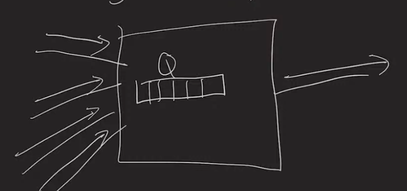
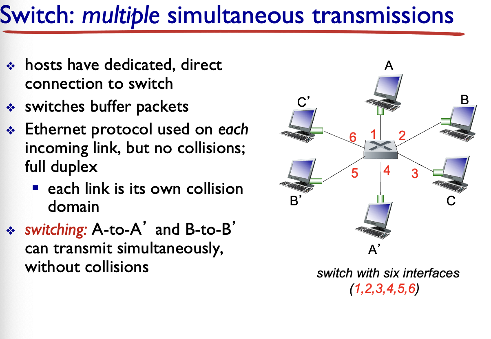

Hots: Want to exchange data

Clients :  initiate connectors 

ServersL Wait for connnector s

Hots: Laptions phonse, desktops. 


Network layer: Host to host communication. Internet communication. VPN will operate on this layer

Transport layer: Transfter info between process to process 

ignore Session and presentation just for now . everything Above Transport layer, there is application layer. 


## **Network Layers Notes Explanation**

* Application Layer : Application specific protocol  HTTP SMTP IMAP DNS

* Transport Layer : process to process TCP, UDP

* Network : host to host. Internet protocol. This means like my laptop being connected to google. It differs from link layer  

* Link : one hop communication. Two devices that are connected together. Connected next each other in the path. 

* Phyical : Transport streams over phycial medium 

  

## Network **Delays**

**Cause of delays** 

1. Physics  distance
2. Entering and exiting devices
3. One device delay 


## Physics delay 

### **1.Propagation Delay**

depends on the distance travelled.  and also see of "link "

**Delay = scale * distance / speed of light** 

if you want to reduce the delay, you can control that by : 

* You can reduce the distance by construct many **data centers** to supply many customers around the world. 

* Yuu can **reduce the scale** by changing the Type of connection example use ethernet instead of fibrotic cable. 

### 2. **Processing delay** 

The time the devices spend examining packets. They only look at the header. They don't look at the whole packet length.   In the order of nansosecond O(ns). It is fixed by device. These hardware are only designed to see the headers of the packets such as IP address of where those packets are going. 

### 3. Transimission Delay 

Time to convert bits to physics.  Time it is takes to convert packet to physical signal. **Exiting the device**

Depeds on 2 things:  

  * **Device**: Transimission rate. The speed at which the devices can convert the digital represantation to pysical represantation.  The rate at which a device can do the transmission. examples. lgbps devise such as fiber and ethernet. S4 MBPS such as Wifi. 

  * **Packet size**.  

    **DelayTransimission = packet Size / Rate** (the rate at which the digital data can be converted to physical represation )  
    
     **[ bits/ bit/s ] => s** 

### 4. Queueing delay 

**Entering the device**

it is possible that the packets can come in faster than how they exit.  As they are arrive they are stored in the ques while waiting to be  sent out.  These queues have Fixed size thus The incoming packet is dropped.  Basically, the queues fill up when incoming traffic rate is greater than the outgoing rate.  The  time Packets speed in Queues. Depends on how the network business. 

**DelayQ = time Packets speed in Queues** 

It is really hard to quantify because it depends on how busy the network is. **It is unpredictable.** 
$$
Incoming data rate = outgoing size * outgoing packet size / S
$$

$$
Traffic Intensity = Incoming rate / R (transimisssion rate)
$$


When there is no incoming trafic, the Traffic intensity of TI is 0. But when it goes up it shows that the queue will fill and packets will be dropped.

* If the T i  >  1 : for a sustained period. Eventually QS will fill and Packets will be dropped 

* TI < 1, Q are getting shorter. 

* TI == 0, means there is no incoming traffic 

  TI can't tell us the dealy time, but bsed on it we can predict that there will be a queue delay based on how the network is busy. 

Queue are like Buffer that hold data for a short of time. But they run of space easily.  

### What can we measure to figure out the delays and what the causes of those delays are. 

Idealy, I would like to measure time it takes to transport data from one host to another. But this is a hard measurement to take. I could start from host 1 and time stamp the time I sent the packet, and on host2, I could check the current time. and find the difference to find the time it take. But this is a hard thing to measure. I will probaly not work. The clocks on both sides might not be in sync. it is hard to synchronize the clock on both hosts (computers). We can't use this method. 


What we can do: Host 1, Time stamp the time you sent the packet and time stamp when the packets comes back. That time is called **Round trip time RTT.** 

ICMP: send a ping and receive a pong and get the round time. 

ping sends the simplest packet that you can to another host and get response from other  host  and it will telll you how long it took. 

**Basically you sent a ping and get back a pong and you can measure rount trip time.**

RTT = host To Processing (~0) + 2 * ( 4 delays For Each Hop)
$$
RTT = host to processing (~0) + 2 * ( 4 delays for each hop)
$$


host to processing is almost always equals to zero.


### EXPERIMENT

you send packet to the same host and get differnt RRT 

100, 120, 110, 149 ms. 

* Propation delay: no. because the distance is the same

* Processing dealy : no bcz the devices is the same

  

#### What might be the cause?

2 main assumptions: 

1. Variability dues to **Queue delay**

2. Assume Queue  delay = 0  for the packet that took the shortest time. In this case 100ms

      	If we know this shortest, to find the average QA you can substact that off from future measurement 

 				**Example** = ( (120- 100 ) + (110 - 100 ) + (149 - 100)  ) / 4 

* propagation estimate based on distance between two links and the speed of the light.  
* For Transimission delay, we can vary packet size
* processing delay: nothing we can do


#### Neat IP Header Trick 

We can do this in case we want to know the information about the hops along the way. 

Header has a **" time to lire the field**". Which is is the number of hops the packet can go. 

Many devices send a respose when TTL hits o. How can we use this property to get intermediate response

There is a tool built in called **Traceroute**. By default it sends 3 packts with TTL 1 towards host 

as it goes through one hop, the TTL increase by one until it gets to the host.

Traceroute: a tool used to get these measurement. 

Example 


If you get strars *** it means you are not getting a response. 


Throughout + Bottleness

Throughout [bits/sec] capacity between hots 

instantenous overuse/sustained 

BottleNeck


**Transportation Layer**

TCP/UDP : Socket interface 

TCP stream socket and UDP is  datagram socket

TCP looks like we are writing to a file 

UDP interface is avery thing addition to network layer. You can send an receive packets. It may or may not get there. 


TLS: encryption. 

QUIC: is a new network layer developed by google. 

Opening a socket requires an AP address  and port number. Where IP address is network layer and port# is the Transport layer 


How would you choose betweeen UTC and UDP

transport layer tradefoods will determine how we choose between datagram and stream

* Reriable data transfer. Network layer doesn;t guaranteee the arrivals of packets TCP does a lot of work. . Data integrity, potentially slow, => then choose **TCP**
* Latency (how long we wait for stuffs). data rate  => then choose **UDP**

Most of the time, TCP is choosen 

**Application Topology**: How are systesms arranged. Example: Client server.  

**Peer to peer** **Topology**

Nodes are both clients and servers. Making use of storage.  Constrains are that: Security, because you don't know how many hosts are involved. 


EXAMPLES

HTTP protocol 

* runs on TCP.
* Text base protocol. Text based protocol is bigger. "GET" is small character
* Request response / Done protoocol. You get the response and close the socket and that's it. 
* Content length header: explict size info 
* Specaial characters `\n`  and space characters `'' ` and `:`  in the header 


## **2 protocols related to Email**

**SMTP** : sending email to the server for forwarding 

* text base

* Sends and receive email 


**IMAP/POP** : receiving email

**Bittorent  PLP protocol** 

* peer to peer : they are clients when they are asking for chuncks of files and servers when they are receivieng files.  It is peer-to-peer in nature, as users connect to each other directly to send and receive portions of the file. However, there is a central server (**called a tracker)** which coordinates the action of all such peers. 

* **Trackers: HTTP servers** 

* Distabtle hash Tables 
* Originaly it was  a TCP protoclo and later switched to UDP torent. 

### DNS:

#####  Domain Name system: Applicatin laye prooclo that enables the network layer 

Example od Domain name: 

1. cs.utah.edu 
2. Shell.cs.utah.edu where .edu is thte top level domain 

What is the IP for this donamin name?  UDP 

## **HOME WORK NOTE**

* Packet routed differently, the packet didn't take different path. 

* The first line, all the packet went throught the same device all took the same route and that's why we get all the delay times on the same line. 
* it is possible to have format like this on other lines.TODO:  Handle this in your code 

## TRANSPORT LAYER

* process are identified by **Port numbers** 
  *  16's 
  * ports > 1024 are called "privilege"

* Servers choose port number 
* Client connections also have port numvbers 
* Clients are assignments what is called "ephemeral ports" . This are free high numbered ports 


### TCP

* connection per connected client 
* Socket objets in Java 

### UDP: 

* The servers get all the packets sent through IPs port 

R dt - send data.    rdt receive

udt - send (data)  udt receive 

The goal is to implement udt send and r dt 

The problem to solve

1. Packet might be dropped
2. Data might be corrupted along the way 


## Reliable Data Transfer 

 Need to detect corruption (check sum ) and acknowledge receipt and possibly retransmit. 

Checksum is a function that both sendder and receiver use to make sure packets are uncorrupted 


### Sender: 

	* Wait for data from app layer.
	* rdt - send data
	* Udt send data, check sum 
	* and wait for ACK (acknowledgement) from the receiver telling them that packets are okay 
	* A happy case, is when sender get an ACK meaning they can send more data
	* Worse case, is sender receive a NACK(negative acknowledgement)  and they will have to send the packet 

### Receiver

* wait for data from Network layer 
* Udt- receive (data, checksum).
* if checksum is okay, send the ACK to sender snd rdt -recive(data,) then send udt to application layer
* if checksum is not okay, send a NACK to sender, and application layer doesn't get any data


### How can a sender know that they get the corrupted NACK into ACK or vice versa

=> Solution: Add a sequence number bit on each packet 

Sender

* Rdar-send , and udt-send (data, checksum, **0**) 
* Wait for ACK. An aCK with 0 sequence number 
* if we receive something else rather than 0 that is going to be considered as NACK 

Handle Dropped packets by using a timeout in the loop

If sender deoesn't recieve a ACK or NACK in RTT then they will know packet has dropped. 

RTT is the minimum 

too small : resengin 

too big: 


Send multipler packet at once and keep track 

1. Send buffer 
2. Receive buffer 


Sliding window alogarithm. The send is restricted to sending only packets with sequence numbers that fall within a given range

Receive buffer: 


Go Back N: 

Receiver sends a cummulative ACK 

Ack has the current receive base. 

**Sender Side**

Send base = Max(send base, ack #)

**Selective repeat:** 

Every packet must be Acked 

The process of sending multiple packets is called **Pipelining** 


## TCP

Transnimission Control protocol 

Main feature 

* Connection oriented 
* RDT 
* **Throttles** senders to protect the **receiver**  called flow control and **network** called ongestion control 
* **Segement** is just a packet in other layers. 

### TCP header: 

Eversy TCP segments can contain data and can contain ACK. 

* A sequence number 
* Ack Number: a response to the other side as a response saying, the data has been received 
* Units of bytes
* Source and destination ports
* Flags : used for establishing and ending TCP connections. These include `syne, ack, FIN, RST`
* RWND: receive window for flow control 

TCP connections starts with TCP handshake. which is the connection between server and client. CLient always initiate the connection 

Client ------------------------> Server 

```sequence 
Client-> server: syn sequence 
```

* The sequence number on one side is related to the ACK number on the other side. 

* The ack number on the other side is also related to the sequence number on the other side. It is the next byte

* Sequence number on one side increases as we send data

* ACK # on one side goes up as we receive in order data. 

* FN -flag means finish 

* Ending the connection is always hard, cz they both have to send `fN, ACK` to each other. and when the ACK 

  Drops, the server stays open for a while


### Send Buffer

* filled by app layer
* TCP uses pipleining 
* Window size changes 

### Receiver buffer 

* **receive phase**.  Have to receiver all the bytes that the sender. has sent. Basically set the size for the window size of the sender

* Application layer reads from receiver buffer and TCP can use that space for more segments

* rwnd: The receive window field is the # of free bytes in my receive buffer 

* Send base -> last ACK + last rwnd 

* Send base is determined by last ACK. 

  


The base case: 

Receive buffer is completly full 

Last ACK has rwnd = 0

The space is made again when the application layer on the receiver side reads the bytes and make room

The data Part of the TCP: can only send one byte 

### What happens when the Sender sends multiple segements with same ACK#

* Means there is a **hole** in the packet caused by packet being dropped. Packets are out of order 

Instead of the sender doing a time out, they **a fast retransimit** which means that the send a duplicate ACKS to say that there  is a hole. 

Certain versions of TCP also have an implicit NAK mechanism—with TCP’s fast retransmit mechanism, the receipt of three duplicate ACKs for a given segment serves as an implicit NAK for the following segment, triggering retransmission of that segment before timeout. TCP uses sequences of numbers to allow the receiver to identify lost or duplicate segments. Just as in the case of our reliable data transfer protocol. 


### **OPTIMIZATION** 

* Wait to send an ack 
* Hopefully response data will be sent and we can inclde it with ACK. => "delayed ACK"


## DNS

```java
import java.io.IOException;
import java.io.InputStream;
import java.io.ByteArrayOutputStream;
import java.util.HashMap;

public class DNSQuestion {
    private String[] domainName;
    private int qType;
    private int qClass;

    public DNSQuestion(String[] domainName, int qType, int qClass) {
        this.domainName = domainName;
        this.qType = qType;
        this.qClass = qClass;
    }

    public static DNSQuestion decodeQuestion(InputStream input, DNSMessage message) throws IOException {
        // Read the domain name
        String[] domainName = DNSMessage.readDomainName(input);

        // Read the question type and class
        int qType = input.read() << 8 | input.read();
        int qClass = input.read() << 8 | input.read();

        return new DNSQuestion(domainName, qType, qClass);
    }

    public void writeBytes(ByteArrayOutputStream output, HashMap<String, Integer> domainNameLocations) throws IOException {
        // Write the domain name using the compression technique
        DNSMessage.writeDomainName(output, domainNameLocations, domainName);

        // Write the question type and class
        output.write((qType >> 8) & 0xFF);
        output.write(qType & 0xFF);
        output.write((qClass >> 8) & 0xFF);
        output.write(qClass & 0xFF);
    }

    public String[] getDomainName() {
        return domainName;
    }

    public int getQType() {
        return qType;
    }

    public int getQClass() {
        return qClass;
    }

    @Override
    public int hashCode() {
        final int prime = 31;
        int result = 1;
        result = prime * result + Arrays.hashCode(domainName);
        result = prime * result + qClass;
        result = prime * result + qType;
        return result;
    }

    @Override
    public boolean equals(Object obj) {
        if (this == obj)
            return true;
        if (obj == null)
            return false;
        if (getClass() != obj.getClass())
            return false;
        DNSQuestion other = (DNSQuestion) obj;
        if (!Arrays.equals(domainName, other.domainName))
            return false;
        if (qClass != other.qClass)
            return false;
        if (qType != other.qType)
            return false;
        return true

```


```java
import java.util.HashMap;
import java.util.Date;

public class DNSCache {
    private HashMap<DNSQuestion, CachedRecord> cache;

    public DNSCache() {
        // Initialize the cache as a new HashMap
        cache = new HashMap<DNSQuestion, CachedRecord>();
    }

    public DNSRecord lookup(DNSQuestion question) {
        CachedRecord cachedRecord = cache.get(question);
        if (cachedRecord != null && !cachedRecord.isExpired()) {
            // If the record is in the cache and not expired, return it
            return cachedRecord.getRecord();
        } else {
            // If the record is not in the cache or is expired, remove it from the cache and return null
            cache.remove(question);
            return null;
        }
    }

    public void insert(DNSQuestion question, DNSRecord record) {
        // Calculate the expiration time of the record
        long expirationTime = System.currentTimeMillis() + (record.getTtl() * 1000);
        CachedRecord cachedRecord = new CachedRecord(record, expirationTime);
        // Insert the record into the cache
        cache.put(question, cachedRecord);
    }

    private class CachedRecord {
        private DNSRecord record;
        private long expirationTime;

        public CachedRecord(DNSRecord record, long expirationTime) {
            this.record = record;
            this.expirationTime = expirationTime;
        }

        public DNSRecord getRecord() {
            return record;
        }

        public boolean isExpired() {
            // Check if the current time is greater than the expiration time
            return System.currentTimeMillis() > expirationTime;
        }
    }
}

```


```java
import java.io.IOException;
import java.net.*;

public class DNSServer {
    private DatagramSocket socket;
    private DNSCache cache;

    public DNSServer(int port) throws SocketException {
        // Open a UDP socket on the specified port
        socket = new DatagramSocket(port);
        // Initialize the cache
        cache = new DNSCache();
    }

    public void start() throws IOException {
        while (true) {
            // Receive a request from the client
            byte[] buffer = new byte[1024];
            DatagramPacket requestPacket = new DatagramPacket(buffer, buffer.length);
            socket.receive(requestPacket);

            // Parse the request
            DNSMessage request = DNSMessage.decodeMessage(buffer);

            // Create a response message
            DNSMessage response = new DNSMessage();
            response.setHeader(DNSHeader.buildHeaderForResponse(request.getHeader(), response.getHeader()));

            // Handle each question in the request
            for (DNSQuestion question : request.getQuestions()) {
                DNSRecord answer = cache.lookup(question);
                if (answer == null) {
                    // If the answer is not in the cache, forward the request to Google
                    byte[] requestBytes = request.toBytes();
                    InetAddress googleDNS = InetAddress.getByName("8.8.8.8");
                    DatagramPacket forwardPacket = new DatagramPacket(requestBytes, requestBytes.length, googleDNS, 53);
                    socket.send(forwardPacket);

                    // Receive the response from Google
                    buffer = new byte[1024];
                    DatagramPacket responsePacket = new DatagramPacket(buffer, buffer.length);
                    socket.receive(responsePacket);

                    // Parse the response
                    DNSMessage googleResponse = DNSMessage.decodeMessage(buffer);
                    DNSRecord[] answers = googleResponse.getAnswers();
                    response.setAnswers(answers);
                    if (answers.length > 0) {
                        // Insert the first answer into the cache
                        cache.insert(question, answers[0]);
                    }
                } else {
                    // If the answer is in the cache, add it to the response
                    response.addAnswer(answer);
                }
            }

            // Send the response back to the client
            byte[] responseBytes = response.toBytes();
            InetAddress clientAddress = requestPacket.getAddress();
            int clientPort = requestPacket.getPort();
            DatagramPacket responsePacket = new DatagramPacket(responseBytes, responseBytes.length, clientAddress, clientPort);
            socket.send(responsePacket);
        }
    }

    public static void main(String[] args) throws IOException {
        int port = 53;
        if (args.length > 0) {
            port = Integer.parseInt(args[0]);
        }
        DNSServer server = new DNSServer(port);
        server.start();
    }
}

```


```java
import java.io.ByteArrayOutputStream;
import java.io.IOException;
import java.io.InputStream;
import java.io.OutputStream;
import java.net.DatagramPacket;
import java.net.DatagramSocket;
import java.net.InetAddress;
import java.net.SocketException;
import java.net.UnknownHostException;
import java.util.HashMap;

public class DNSServer {
    private static final int PORT = 53;
    private static final String GOOGLE_DNS = "8.8.8.8";

    // Open up a UDP socket and listen for requests
    public static void main(String[] args) {
        DatagramSocket serverSocket = null;
        try {
            serverSocket = new DatagramSocket(PORT);
            byte[] receiveData = new byte[1024];
            System.out.println("DNS Server started on port " + PORT + "...");

            while (true) {
                // Receive request from client
                DatagramPacket requestPacket = new DatagramPacket(receiveData, receiveData.length);
                serverSocket.receive(requestPacket);
                byte[] requestedDataMessage = requestPacket.getData();

                // Decode the received request
                DNS_Message requestedMessage = DNS_Message.decodeMessage(requestedDataMessage);

                // Check the cache for a valid answer
                DNS_Cache dnsCache = new DNS_Cache();
                DNS_Record[] answers = null;
                for (DNS_Question question : requestedMessage.getQuestions()) {
                    answers = dnsCache.queryingRecords(question);
                    if (answers != null) {
                        break;
                    }
                }

                // If a valid answer was found in cache
                if (answers != null) {
                    // Build response using the valid answer from cache
                    DNS_Message responseMessage = DNS_Message.buildResponse(requestedMessage, answers);
                    byte[] responseData = responseMessage.toBytes();

                    // Send the response back to the client
                    DatagramPacket responsePacket = new DatagramPacket(responseData, responseData.length, requestPacket.getAddress(), requestPacket.getPort());
                    serverSocket.send(responsePacket);
                } else {
                    // Create another UDP socket to forward the request to Google (8.8.8.8)
                    DatagramSocket clientSocket = new DatagramSocket();
                    InetAddress googleAddress = InetAddress.getByName(GOOGLE_DNS);
                    DatagramPacket requestPacketToGoogle = new DatagramPacket(requestedDataMessage, requestedDataMessage.length, googleAddress, PORT);
                    clientSocket.send(requestPacketToGoogle);

                    // Receive response from Google
                    byte[] responseDataFromGoogle = new byte[1024];
                    DatagramPacket responsePacketFromGoogle = new DatagramPacket(responseDataFromGoogle, responseDataFromGoogle.length);
                    clientSocket.receive(responsePacketFromGoogle);

                    // Decode the response from Google
                    byte[] responseDataMessageFromGoogle = responsePacketFromGoogle.getData();
                    DNS_Message responseMessageFromGoogle = DNS_

```


```java
public String[] readDomainName(InputStream inputStream) throws IOException {
    // Create a list to store each label (part) of the domain name
    List<String> domainLabels = new ArrayList<>();
    
    // Read the first byte to determine if it's a compression pointer or a label length
    int lengthOrPointer = inputStream.read();
    
    while (lengthOrPointer != 0) {
        // Check if the highest 2 bits of the byte are set (11000000)
        if ((lengthOrPointer & 0xC0) == 0xC0) {
            // If the highest 2 bits are set, this is a compression pointer
            // Get the pointer value by combining the current byte with the next byte
            int pointer = ((lengthOrPointer & 0x3F) << 8) | inputStream.read();
            // TODO: Read the domain name from the message at the specified pointer
            // For now, just return an empty array
            return new String[0];
        } else {
            // If the highest 2 bits are not set, this is a label length
            int labelLength = lengthOrPointer;
            // Read the label from the input stream
            byte[] labelBytes = new byte[labelLength];
            inputStream.read(labelBytes);
            // Convert the label bytes to a string and add it to the list of domain labels
            domainLabels.add(new String(labelBytes, StandardCharsets.UTF_8));
            // Read the next length or pointer byte
            lengthOrPointer = inputStream.read();
        }
    }
    
    // Convert the list of domain labels to an array and return it
    return domainLabels.toArray(new String[0]);
}

```


IPV4 

Requirese unpdating all devices including routers. 

Tunneling 

Control Planet


Basically creating forwaring tablets. 

Modern networks use a software deinfed networking

Routes are connected in a weighted graph. 

Shorted path problem

SIngle source shortest path. 

Forward Table 

What are the inputs to this alogarithm

Global Alogarithm and it requires knowldges of all edges/weights. 

OSPF: Each node broadcasts into obryt is attached edgesf

### **Bellan Ford Alogarithm** 

Bellman Ford algorithm helps us find the shortest path from a vertex to all other vertices of a weighted graph.

min (X , N) = min neighbor of x  e edge (x,n) edge (X,N) + min(x,N) // very

`Distance(x,y) = min(edge(x, neighbor ) +  distance(neighbor, y ))`

At each node, store the "distance vector" 


### Network of Network. 


## **LINK LAYER: BroadCast** Channel 

When many devices uses the same pysical channel for sending data, we call it broadcasting. 

Weh two or more devices trynig to transimit simulatenously => collision, 


### Goals

* **Fairness** when multiple devices are transimitting 
* If only 1 devices is transmitting, it should get all the transitmission time. **Good use of resources**
* Protocol should not require extra data to be sent. **Simple**


### Taking turns proctocol

* Some nodes is in chase and assigns devices to get transom time. Nodes taking turns to eachother. Wait untile it is your turn. 

* It is fair but inefficient when there is low load. because nodes 

  

  ### Slotted ALOHA**

  ​	split and divide time into slots  and assume all device are synched. 

  ​	if you want to transimit in the next slot, there might be collisions=> resend timeslot. But this would end in     	infinite. 

  

  * The more there is devices sending at the same time, the more there is high probality of collision. Flip coins to see which one sends first. 

* Case1: send without collision first and try successful reset. Collission on resenf wasted slot. Everyone waiting. 

  ### Unslotted ALOHA

  * meets the goals
  * Successful packet transimitted 50% down . becuause one node can interfere with two other nodes

  

## Carrier Sense Multiple Access CSMA

* Avoid collision, listen for collisioin 
* DOn't start transimit if someone else is transimitting 
* Stop as soon as a collisioin is detected
* More effecient one becase there is less collission
* Uses commone sense. 
* As collision detection time goes to 0, the % of used time goes upt to 100%


## Cable Internet 

* It is a broadcast channel 

* CMTS -----------> shared among neighbor 

  * Downloads are board cast and 1 transimitter (CMTS) but nothing as the collisions 
  * Assume that CMTS Is always there 
  * This is considered as Taking turn protocol 

  

  

  

# Ethernet, LANS

We need a new way to identify devices at the Link layer. Which is caled **MAC address**. in bytes. Are also called pysical addressees. 

**ARP**: Address Resolution protocol, Unlike  DNS message like who ask for Ip address ARP ask who has the IP address and it gets back mac address. 

### Switch works:

1. when to broadcats and it has a switching table where it keeps the MAc address anf the table link. 




* switch *learns* which hosts can be reached through which interfaces

* when frame received, switch “learns” location of sender: incoming LAN segment

* records sender/location pair in switch table


### HUB: Precessor to the switch. 

it is like a switch but it always broadcast. 

### Ethernet Protocol 

* Hasn't changed  for 30 + years

* cheap

* Simpler, cheaper than token LANs and ATM

* Checksum (CRC) => network layer tyep 

* Interesting port 

* Sendig adapter encapsulates IP datagram 

* **Preamble:** 

  	* 7 bytes with pattern 10101010 followed by one byte with pattern 10101011
  	* It is alwats the same sequences  of 10101010
  	* It is used to synchronize receiver, sender clock rates. 
  	* Preamble is the ethernet header

  


## **Switches vs Routers** 


* switches are inneffective when the destination gets bigs

  | Switches                    | Routers                                                      |
  | --------------------------- | ------------------------------------------------------------ |
  | Switching table 1 entry per | Forwarding table hierrachial with practices. Forwarding table have to be manually configured by software. |
  | Tree topologies             |                                                              |
  |                             |                                                              |

  

* What are the layers

* WHat are the protocols involves

* Tools involved 

* Networks:

  ​	* what happens to a packet when 


# Network Security 

##  Crypto

1. Confidentiality : only sender, intended receriver should understand message contents
    	*  Sender encrypts messages
    	*  receiver decrypts message 
2. message intergrity: not tampered 
3. Authentications: :know who we are talking to. Example: Little Rock 
4. No repudiation: no back sizes. 


