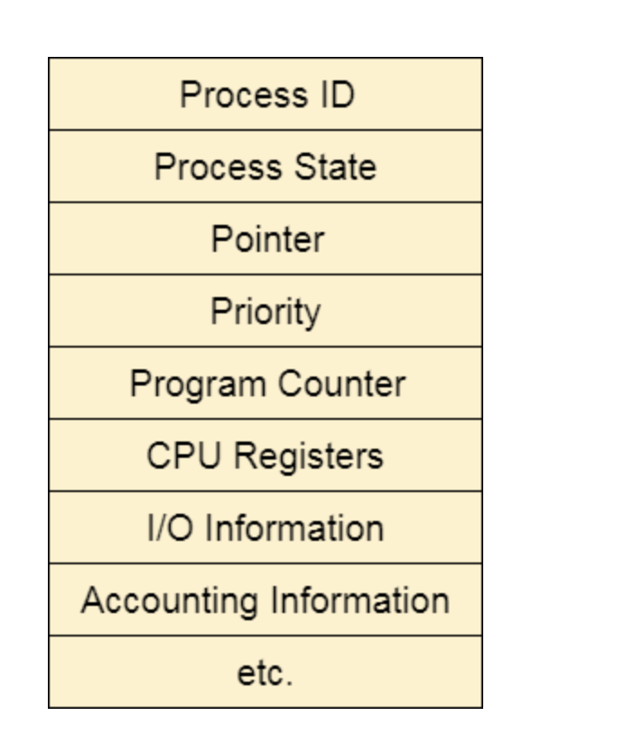
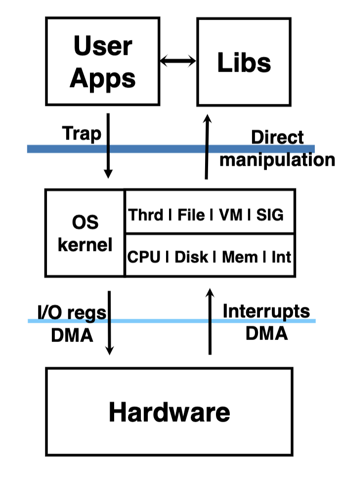
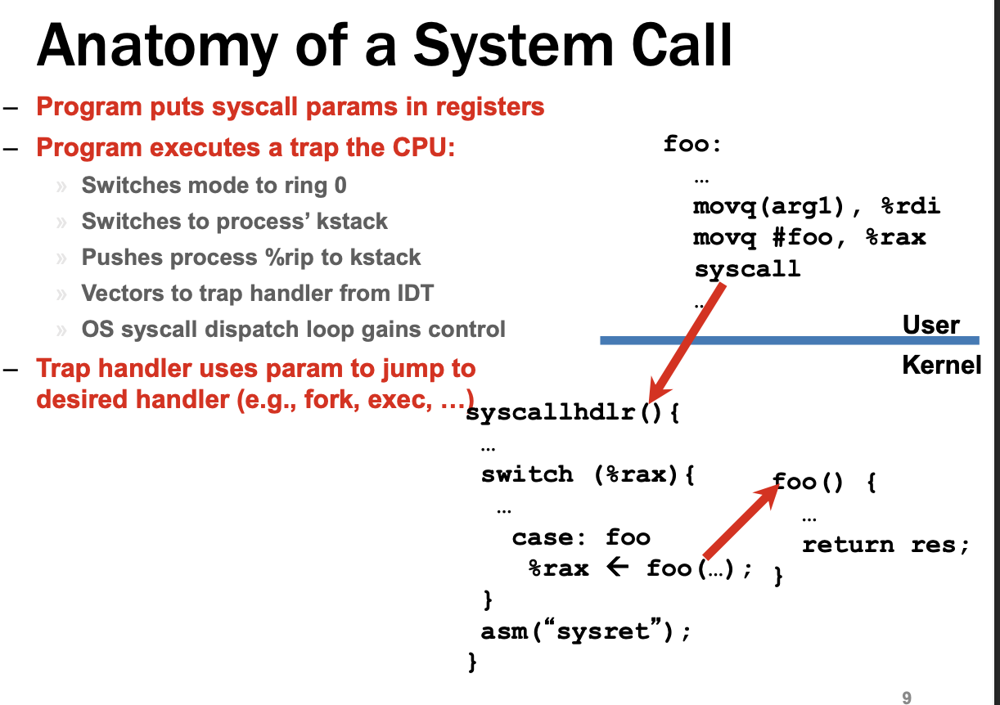

HISTORY of Operating System 

There are different phases: Check the slides. 

C language was created specifically to program linux. 


NOTES

## **Microprocessor markets**

* Servers
* Most of the Desktops computers
* embeddded processors: ex: mobile processors ,Mac (IRM based cheap), cars

Von Neumann Architecture. 

Today computers use Von Neumann Architecture. 


CPU, RAM < and inout/outoput devices

All these three compotents are connected using the bus

They all seat on the motherboard.  

* The ram goes on the right corner on the colorffull slots (yellow and red)

* CPU goes on the blavk cage 

* There is alaos power controls 

* the blue is thing is middle and the white things the PCI (perfical connectsd interface) : external decives that assist in the functionality of the computer

* the orange thing is the hard disk case. this is where they will be plugeed 
* underneath the motherboard there is a connected wires which are the bus connecting all componets
* a bus is a simplified way for many devices to communcate to each other 
* looks like a highway of information 


### CPU inside

* It is has a back called memeory registers: temporary memonry on the memory. 

* They are actually physical part of the CPU that holds information that needs for a particulary inforamtion

* The instryction registar holds the current instruction. 

* Instr oiinter hols the current pointer. We whe increment the IO we we will go to the next instruction to the RAM 

* Control Unit is a state machine. FEctch informatioin from the RA, also increament the instruction pointer. It always goes from one state to another 

  1. Does the **fetching** : asks the RAM fo the instruction whose addss is stored in IP

  2. **EXecture**:  add stotore, jum to this address, not things like for loop. There is finite number of Instructions. If its arithmetic it will asks ALU to do that 
  3. Repeat: it will keep cycling 

Example: 

two varriable 

a , b , and c to hold the sum of and b in memory

When to weite this program in theyour lang. The computer alwasy kts down the instructions in cpu 

such as load a into register r1 


Os doesn't trust computers: 

Most CPU have Privilege rings:

* User mode
* Kernel  mode


Common Instruction: 

1. Compare: act like a if statement
2. Jump: act like a for loop


Anatomy of instruction

* mnemonic<operands>
* Example:
* Add edt, esi. where edt and esi are names of registers

Modern registers:

* ax, bx, cx : 16 bits
* rax,rbx, Rex: 64 bits 
* [ ] memory access: it is always accessing RAM memory access
* You can't use strings as operands, you can only use ints. Strings 
* Xor is inclusive or, where every bits is XOR with itself with 0 (bit manipulation)


## Register protocol 

### Managing the stack

* Stack pointer will be stored in **r sp** 

* the stack direction in assembly goes down. 

* r sp down 12 times (r sp-12) to know the size of the stack

* In order to keep track of the stack size. The second pointer is called frame pointer or the base pointer.

   **r bp** . These pointers hold the addresses of stack they are pointing to in the memory 

* r bp never changes. 
* Any time a function is going to use stack frame it has to push **r bp** and when it's done it pop  **r bp**  and uses r sp to allocate more memory. We use offsets of r sp 

### Examples // watch lecture and update notes

`push			rbp` 

`move rbp 			rsp`

`DWORD PTR [rbp-8]  ` means double word pter 

`mov rbp rsp` // destination is  

Any time you write a function and return 0 , the value has to be put in `eax` 

`move eax, 0`


You need rsp when you need to allocate the space of 


## Function Calls

* Caller -saved: **temporaries registers** example: `%r10` and `rsi` 
  * call a function and register value change on return 
* Callee- saved: **preserved** ex: `%rbx`  and `%rsp` 
  	* call function and register value stays the same

## System calls

Set of instructions that user programs can call that request the **kernel** to do something for them.

When a syscall is made, the CPU switcheds to kernel mode. Perfoms the task, then switches back to user mode when it returns. 

Uer application make system calls to execute privilleged instructions. 


Example of GodBold: Hello world 

```c++
#include<unistd.h>
#include<sys/syscall.h>
int main (int argc, char** argv) 
{
syscall(SYS_write,1,"Hello, world\n", 14); 
}

// 14 is the nbr of bytes to write to
// 1 is the file desciptor of where to write to 
```

Assemby 

```c++
.LC0:
        .string "Hello, world\n"
main:
        push    rbp
        mov     rbp, rsp
        sub     rsp, 16
        mov     DWORD PTR [rbp-4], edi
        mov     QWORD PTR [rbp-16], rsi
        mov     ecx, 14
        mov     edx, OFFSET FLAT:.LC0
        mov     esi, 1
        mov     edi, 1
        mov     eax, 0
        call    syscall
        mov     eax, 0
        leave
        ret
```

##### **Explanation** 

1. `".LC0"` is a label that is used to identify the location of the string "Hello, world\n" in memory.
2. `"push rbp"` saves the current value of the base pointer register (RBP) on the stack.
3. `"mov rbp, rsp"` moves the current value of the stack pointer (RSP) into the RBP register. This is done to establish **a new base pointer for the program's stack frame.**
4. `"sub rsp, 16"` subtracts 16 from the current value of the stack pointer (RSP), effectively allocating 16 bytes of memory on the stack. This memory is used for local variables or temporary storage.
5. `"mov DWORD PTR [rbp-4], edi"` stores the value in the **EDI** register at the memory address [RBP-4].
6. `"mov QWORD PTR [rbp-16], rsi"` stores the value in the **RSI** register at the memory address [RBP-16].
7. `"mov ecx, 14"` loads the value 14 into the **ECX** register. This value is used as the number of bytes to be written to the file descriptor.
8. `"mov edx, OFFSET FLAT:.LC0"` loads the memory address of the string "Hello, world\n" into the **EDX** register. This value is used as the buffer (memory location) where the string is stored.
9. `"mov esi, 1"` loads the value 1 into the **ESI** register. This value is used as the file descriptor (1 is the standard output) to which the string is written.
10. `"mov edi, 1"` loads the value 1 into the **EDI** register. **This value is used as the system call number, in this case SYS_write**
11. `"mov eax, 0"` loads the value 0 into the **EAX** register, this is not used in this example. ?**?**
12. `"call syscall"` calls the syscall function, with the values of the **EDI**, **ESI**, **EDX**, and **ECX** registers being passed as arguments.
13. `"mov eax, 0"` loads the value 0 into the **EAX** register, which is the return value of the program.
14. `"leave"` is an instruction that is used to deallocate the stack frame that was created by the "push rbp" and "mov rbp, rsp" instructions. It moves the value of the rbp register into the rsp register, and then pops the value of the rbp register from the stack.
15. `"ret"` returns control to the calling function.

This version of assembly code uses the leave instruction to deallocate the stack frame and it also has the extra instructions to save the values of EDI and RSI to the stack.

### NOTES

* `"pop rbp"` restores the previous value of the **RBP** register from the stack.

* In assembly language, "DWORD PTR" stands for "double word pointer." It is used to specify the size of the memory location that the instruction is operating on.

* **A "double word" is a unit of data that is typically 32-bits in size.** So, **"DWORD PTR" specifies that the instruction is operating on a memory location that is 32-bits in size.**

*  The instruction `"mov DWORD PTR [rbp-4], edi"` in the example above is moving the value stored in the `edi` register into a memory location that is `32-bits` in size and located at the address `[RBP-4]`. Similarly,` "mov QWORD PTR [rbp-16], rsi"` is moving the value stored in the RSI register into a memory location that is 64-bits in size and located at the address [RBP-16].

I instruction format is architecture-dependent, in x86 architecture DWORD is used to indicate 32-bit data, whereas in x86_64 it is used to indicate 64-bit data.


Lab Notes 

This is an assembly program written in x86 assembly language. The program appears to be written for a 32-bit architecture, and it makes use of the x86 calling conventions for function calls.

The first line, `.LC0:`, is a label that marks the beginning of a string constant. The string is "%d" which is the format string passed to the printf function later in the program.

The next line, `main:`, is a label that marks the beginning of the main function of the program.

The following lines:

- `push rbp` saves the value of the base pointer (rbp) on the stack.
- `mov rbp, rsp` move the value of the stack pointer (rsp) into the base pointer (rbp).
- `sub rsp, 16` subtracts 16 from the stack pointer, allocating 16 bytes of space on the stack.
- `mov DWORD PTR [rbp-4], edi` stores the value of the edi register into the memory location pointed to by the base pointer minus 4 bytes.
- `mov QWORD PTR [rbp-16], rsi` stores the value of the rsi register into the memory location pointed to by the base pointer minus 16 bytes.
- `mov esi, 6` move the value 6 into the esi register.
- `mov edi, 4` move the value 4 into the edi register.
- `call int add<int>(int, int)` calls the add<int> function, passing the values in the edi and esi registers as the first and second arguments, respectively.

The next three lines:

- `mov esi, eax` move the value of the eax register into the esi register.
- `mov edi, OFFSET FLAT:.LC0` move the memory address of the constant string "%d" into the edi register.
- `mov eax, 0` move the value 0 into the eax register.

The next line:

- `call printf` call the printf function, passing the address of the string "%d" in the edi register and the value in the esi register as the argument.

The following two lines:

- `mov eax, 0` move the value 0 into the eax register.
- `leave` is equivalent to mov rsp, rbp; pop rbp. It restores the previous value of the stack pointer and pops the previous value of the base pointer from the stack.
- `ret` return from the main function.

The following lines are the definition of the `add<int>(int, int)` function which takes two integers and returns the sum.

- `push rbp` saves the value of the base pointer (rbp) on the stack.
- `mov rbp, rsp` move the value of the stack pointer (rsp) into the base pointer (rbp).
- `mov DWORD PTR [rbp-4], edi` stores the value of the edi register into the memory location pointed to by the base pointer minus 4 bytes.
- `mov DWORD PTR [rbp-8], esi` stores the value of the esi register into the memory location pointed to by the base pointer minus 8 bytes.
- `mov edx, DWORD PTR [rbp-4]` move the


MY NOTES

```
push rbp: This is saving the va

.LC0:

​        .string "%d"

main:

​        sub     rsp, 8

​        mov     esi, 10

​        mov     edi, OFFSET FLAT:.LC0

​        xor     eax, eax

​        call    printf

​        xor     eax, eax

​        add     rsp, 8

​        ret
```

compilation flag to -O3 -std=c++17. 

# PROCESS 

There is a difference between a process and a program. 
a processs is an instance  of a program 

Each process has a state: 
* new
* ready 
* running
* blocked
* terminated 

Depeding on what the process is doing, the current running process is instruction  pointer. 
In other words, instruction pointer holds the instruciton of what the process is currenlty going to execute. 

Every hard Ware device has a state. Keyboard, mouse, etc...
Thread is not  a process. 
Process are isolated, and has its own PCB (Process Control Block). Thread run inside a process



Multithreading are faster than process. They solve two different issues. 

A zombie process 

Proceess run on the Hardware, and each time you run you have to switch switch 

Struct holds the instructions. To ease in and out 

Enum has the states

Each process has its own unique ID. It stays the same, even if you switch from one queue to another

Get the ID from the header of the process, you will get the ID. 

Interprocess communication: Processes talking into each other through a pipe. It is always the runs in one way. If you want 


Write a program that calls. 

* `getpid()` returns the current process ID
* `folk()` creates a new process


## Typically  OS has 3 levels 

1. User Level
2. Kernel Level
3. Hard Ware Level




* To switch from User to kernel =>  You do traps such as Syscal
* 


# Lecture 8: Limited Direct Execution (LDE), Traps, Interrups


## Low cost Process Isolation? 

1. ### Virtualization 

* How do you allow multiple program to share the cpu  at the same time? 

* There has to be virtualization of the CPU. For the program to share the cpu 

* Find time share the cpu among process. basic idea is run one process for a little while and then run the other one and so forth.  This is what is called **virtualization** 

  


2. ### Isolation 

* why would you want the process to be isolated from one another? You could have one program mix up with another. End up with pointers pointing into a different process
* Kernel must isolated from other process? Why? Without the kernel there is no way for the process to run on the hardware. Kernel must also be isolated from user mode. 
* Hardware must be isolated from process. Why? You don't want to worry about the hardware. When wrting program/ code you don't want to worry about the interference of harware. 


3. ### Perfermonce

   * process should run full hardware speed. 
   * Should expect full speed 

   

Virtualization, isolation, and performance constitute a technique called **Limited Direct Execution.** The program will run on cpu with some constraints. 


## X86 Privilege/ protection rings

* the more you are close to the middle, the more you are more previledge. 


* **Ring 0 -kernel mode:** OS has resources to the full resources of the machine 

* **Ring 3 : user mode.**

  	*  Applications do not have access to the hardware resources.      
  	*  Bu can  read/ write registers. do math 
  	*  can not chnage page table, access devices, can't access other processes' memory

  **For example:** when runing in user mode, a process can’t issue I/O requests; doing so would result in the processor raising an exception; the OS would then likely kill the process.

* **RIng 1 and Ring 2 are rarely use**d. 

* Ring -1 (also called **Hypervisor**).  Hypervisor allows gues operating system to run ring 0, Hypervisor use to create and run virtual machine. **Hypervisor** : Allow an operating system to run independently from the underlying hardware through the use of virtual machines. 


# Challenges With Limited Direct Execution 

1. Must have restricted access. 
   * restricted access of to memory
2. Prevent Denial of services. They have to share. 
   * have a control over the process to avoid entering infinite loop. This required scheduling interrupts that return CPU to kernel 
   * Access to interupt mechnism has to be restricted. The interup here is to tell the cpu to switch. Those are sensistive state. For example: file i/o 


## Problem #1: Sensitive State

* Hide device control registers from applications

There are some instructions that you can access. For example:  register cr3=> control register. You can't access cr3.  Its jobs is to convert virtual address to real ones. You may access it though sys call. 

* Any time you run low privilege level => need to be on ring 3
* Anytime you run high privilege level => need to be on ring 0

Page table: contains set of virtual address. And actual pysicall location. It can be on RAM or on disk. 

### **%cr3**

* CR3 is the page directory base register: It loaded and will never be changed. 
* It is stored on the CPU. not on the RAM because if it  is on the RAM in sensitivive area, we can't know what that is. 
*  Most importantly to allow the CPU to fetch the physical  address from RAM. cr3  contains pointers  to pysicall address in RAM. 
* Thus, enables CPU to fetch the pysical address from the RAM.  
* If there is no Pyhyicall address present, the use a specialized hardware Called Memory Management Unit (**MMU**) whose job is to generate the pysicll address from a virtual address. 

Not all CPU has MMU. But most modern ones have MMU. 

If the OP want to change what is the table, it changes the %cr3. No need to reboot


## Traps, Interupts, and Context and Switches

Virtual Address Space: located on PCB : **Process Control Block.** 

* Stack is part of PCB
* Each PCB has a part that lives in user space and other part on the user mode. 
* Part of PCB that lives on in the Kernel mode is called **kstack**
* Protect access to unmappaed regions. +. MMU hardware will do it for us


### User Mode to kernel Mode 

* use a syscall to swtich from usermode to Kernal mode. 
* The syscall  is done via  exception control flow


### Four Kinds of Exceptions

1. #### Interupt 

   	* asynchoronis. No control of it. It just happens. No Sequential.
   	* Hardware interupt: Caused by ellectronic signals originating from hardware, such as key pressed 
   	* Software interupt: Caused by set of instructions. 

2. #### Traps

   * Synchronous. Intentional. An instruction you call as part of interupt the regular  functioning of the program. Sequential 
   * Example: **Syscall**, **break poin**t. => stop and resume the program, **overflow**
   * 

3. #### Faults 

   * Unintentional. Things that are illegla to execute, such as divide by 0
   * Floating pointer exceptions. 
   * Results in retry or abort  

4. #### Abort 

   * results into abort 
   * **Example: Double faul**t : If interupt handler can't invoke because interupt handler isn't present or is invali. Basically the only OS bugs. Execptions that causes other exceptions to happen.bad thing to happen

   

   ### Digression: Debuggers!

* When you introduce a break point you introduce a trap. The debugger puts the the trap in the program. The debugger is introduced the trap instructions. it inject the instruction trap to make a trap and will remove the injection when you switch to run mode. 
* That instruction is called `int 3 instruction` where int stands for interupt
* Debugeer is copying the instruction at the line where you introduced the break point and then it replaces the first byte of that line with `int 3 `instructions. `int 3 `will take a total of 1 byte.
* Then after the debugger  asks a OS to run program on CPU which cause the trap into OS. OS doesn't know anything. 
* Swiches to ring 0
* Once the OS confirms the stop(when user clicks resume, or step in or step over or stop or stop)
* Debugger will replace the `int 3 instruction` at the break point with the original instruction
* roll the instruction pointe roll back by one


## Interrupt Descriptor Table

* Doesn't contain code but contains 

* hold the pointer to the function that will be executed.

  ### IDT 

  * tells cpu what to do 
    * on each type of trap
    *  on each type of interrupt. 

  ### IDTR 

  * points to IDT(Interrrup desctipt table)

  ### Cli/sti instructions

  * avoids interrupts durning interrupt handling

    

## SYSCALLS

* Processes induce syscalls with a trap
*  syscalls's entry is at `int $)x80` 
* CPU consults its interrupt descriptor table to know what code to run on trap




## Problem 2: Must prevent denial of sercies: must share

* For Example if a process entes an infinite loop and takes up all the momeory space. There has to be a way of stoping that process. 

  To solve this : 

  	* Schedule periodically **interrupts** that returns CPU control to the kerneal. This is not a trap it is an interrupt

* Process could schedule massive I/O. 
     * De-schedule processes while they perform I/O


### OS Requirement for multiprogramming

* **Develop Policy**: decision of what program to run and when
* **Mechanism**: How does the switch happens? Two things involves
  * Dispacth: Tells which procecess we want to swap 
  * Context Switch : actual mechanism of switching

**NOTE**: if you are running the a program which is perfomence and time sensitive. Kill all programs that are running on the your machine. Reserve a fix hard ware. 


Monday Feb 06

Work Load: For


## Scheduling 


## PIPES

Inter process communication. Data flows in a one direction. Can't send data from A and B at the same time. 

Before forking you will create a pipe. 

1. Create a pipe using pipe command
2. Fork()
3. now parent and child can read and write to the pipe
4. 

the last step should be use read in the **child** to read from the pipe


### few steps to keep in mind.

1. pipe()

2. fork ()

3. exec() 


// nOTES
Set up the 


### **Virtualization memory**

HW

* When you open the new fd in dup, the old one will silently close 
* When you dup2, the old one are gone. Create a new array of file descriptor 

Static relocation and Dyanmic reloctaion 

PAGING
fixed fixed size of 4K chunks!


## Page Replacement

Victim replacement

* OPT : Replace page not usd  for longer time in the future. Not effectienty, and not practice 

* FIFO: Replace the page in the memory that's been in the memory longer regardless of how recently it was accessed. 

* LRU(Least Reclty used): replace page not used for longer time in the past

* Least Frenquently used. 

* **CLOCK alogarithm**: the practical alogarithm. Use the bits to identify those has not been recelty used. And remove those page to kickt them out. Refer Class PPT.

  Like advancing a clock hand through the pages.

  ```
  if (R == 0)
      replace
  else
      reset R
      advance hand
  ```

A clock hand points to some particular page to begin with (it doesn’t really matter which). When a replacement must occur, the OS checks if the currently-pointed to page P has a use bit of 1 or 0. If 1, this implies that page P was recently used and thus is not a good candidate for replacement. Thus, the use bit for **P is set to 0 (cleared)**, and the clock hand is incremented to the next page (P + 1). 

**Reference**. 
http://web.cs.wpi.edu/~cs3013/b00/week5-pagereplace/week5-pagereplace.html


